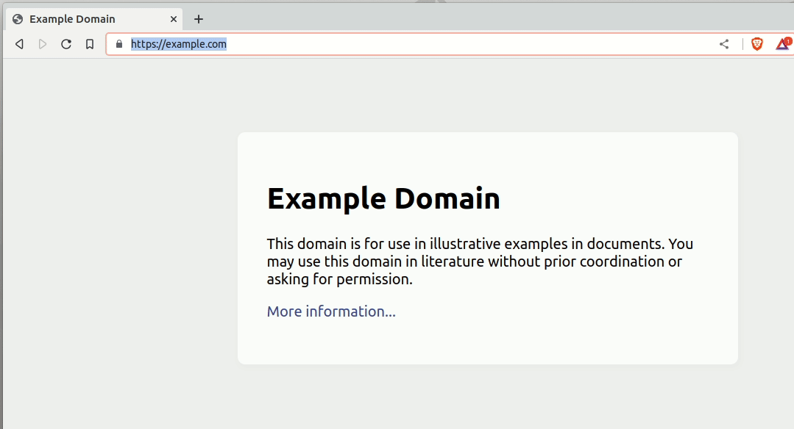

# sci-chrome-ex

A Chrome extension to evaluate code entered into the URL bar 
(the ["omnibox"](https://developer.chrome.com/docs/extensions/reference/omnibox/)) 
with the [Small Clojure Interpreter (SCI)](https://github.com/babashka/sci).

Status: work in progress, hobby project.

- [x] Evaluate code typed into the URL bar
- [x] Float a REPL window to evaluate code on the current page
- [ ] Rendering of non-text results (e.g. react components -- maybe I could do 
      this via [Scittle](https://github.com/babashka/scittle)?)
- [ ] Some kind of user.clj file to define helpers. Ideally one could define 
      helpers to float e.g. order books on the current tab and call them from 
      the address bar `sci (custom-book-helper :binance/btcusdt)`. 

## Development

Start the shadow-cljs development server with 

    bb dev

Then load the public/ directory as an unpacked extension in Chrome/Brave.
