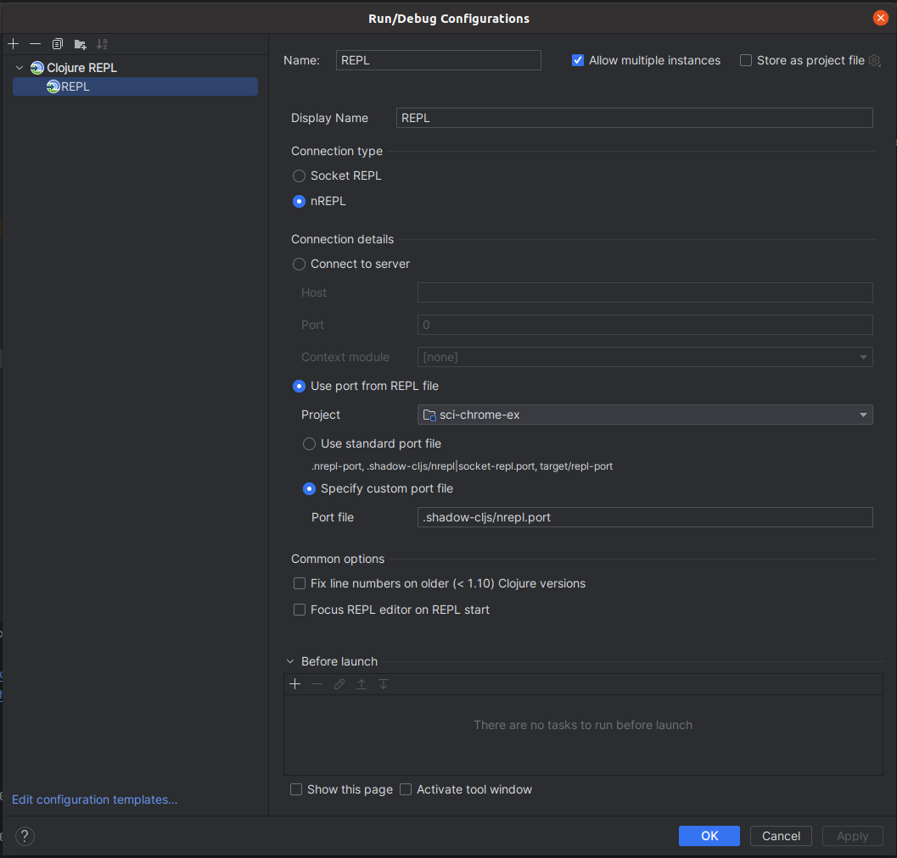

# sci-chrome-ex

A Chrome extension to evaluate code entered into the URL bar 
(the ["omnibox"](https://developer.chrome.com/docs/extensions/reference/omnibox/)) 
with the [Small Clojure Interpreter (SCI)](https://github.com/babashka/sci).

## Development

Refer to the `shadow-cljs` documentation.

Run

    shadow-cljs watch :app

and then connect to the nREPL port and run

    (shadow/repl :app)

Links for me:
- https://shadow-cljs.github.io/docs/UsersGuide.html#_cursive

### REPL
Configure the REPL as such, start a REPL server with `npx shadow-cljs server`,
and run `(shadow/repl :your-build-id)` inside the IntelliJ REPL.

